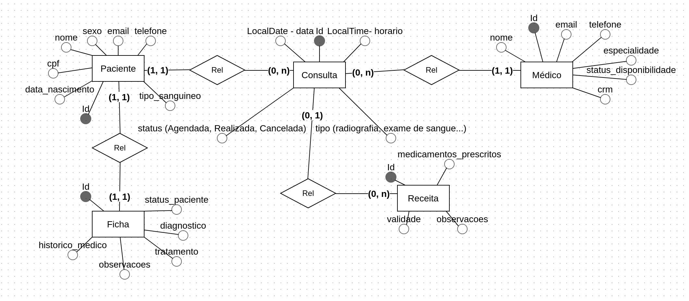
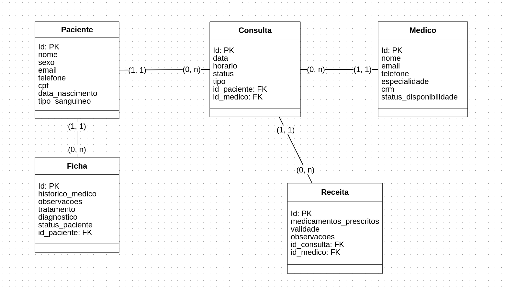

# Clínica Médica API

Projeto back-end criado para a disciplina de **Desenvolvimento de Aplicações Web II** e aproveitado na matéria de **Análise e Projeto de Sistemas**. A aplicação foi construída utilizando **Spring Boot** e **PostgreSQL** como banco de dados, visando criar uma API REST para a consulta de informações de um banco de dados de uma Clínica Médica fictícia originalmente desenvolvido como parte da disciplina de **Banco de Dados 1**.

Membros do Projeto:
- Pedro Henrique Alexandre.
- Vinicius Cavalcante Pequeno.
- Thiago dos Santos Araújo (como parte da matéria de Análise e Projeto de Sistemas).

## Tecnologias Usadas

<div align="center">


</div>

## Esquema Conceitual

<div align="center">



</div>

## Esquema Lógico

<div align="center">



</div>

## Funcionalidades

* **Cadastro e Gerenciamento de Pacientes**
* **Agendamento de Consultas Médicas**
* **Cadastro de Exames e Procedimentos Médicos**
* **Criação de Receitas Médicas**
* **Registro de Fichas Médicas**


## Estrutura dos Arquivos

- **Controller**: Responsáveis por definir os endpoints da API.
- **Model**: Representa as entidades do banco de dados e seus atributos.
- **Repository**: Arquivos que fazem a conexão com o banco de dados.
- **Service**: Contêm a lógica de negócio para manipular e consultar os dados.
- **Util**: Contêm arquivos com metodos de validação dos dados das entidades da clínica.

## Como Executar
### Pré-requisitos

- **Java 17** ou superior
- **Maven** 3.8.1+
- **PostgreSQL**

### Passos para execução

1. Clone o repositório:
   ```bash
   git clone https://github.com/Pedroo722/Clinica_Medica-API.git
   cd .\Clinica_Medica-API\
   ```

2. Compile o projeto:
   ```bash
   mvn clean install
   ```

3. Execute o projeto:
   ```bash
   mvn spring-boot:run
   ```

4. Acesse a API em: `http://localhost:8080/api/{endpoint}`.


5. Acesse a UI do Swagger em `http://localhost:8080/swagger-ui/index.html#/`.


## Endpoints

A API fornece os seguintes endpoints para a manipulação de dados relacionados a pacientes, médicos, consultas, receitas e fichas médicas. Cada endpoint permite as operações básicas CRUD.

### Paciente
- **GET** `/api/patients/list`: Recupera todos os pacientes. Permitindo a filtragem pelos parametros *`?name=`* & *`?cpf=*`*.
- **GET** `/api/patients/list/{id}`: Recupera um paciente pelo ID.
- **POST** `/api/patients/create`: Cria um novo paciente.
- **PUT** `/api/patients/update/{id}`: Atualiza um paciente existente.
- **DELETE** `/api/patients/delete/{id}`: Remove um paciente pelo ID.

### Consulta
- **GET** `/api/consultations/list`: Recupera todas as consultas.
- **GET** `/api/consultations/list/{id}`: Recupera uma consulta pelo ID.
- **POST** `/api/consultations/create`: Cria uma nova consulta.
- **PUT** `/api/consultations/update/{id}`: Atualiza uma consulta existente.
- **DELETE** `/api/consultations/delete/{id}`: Remove uma consulta pelo ID.

### Médico
- **GET** `/api/medics/list`: Recupera todos os médicos. Permitindo a filtragem pelos parametros *`?name=`* & *`?crm=*`*.
- **GET** `/api/medics/list/{id}`: Recupera um médico pelo ID.
- **POST** `/api/medics/create`: Cria um novo médico.
- **PUT** `/api/medics/update/{id}`: Atualiza um médico existente.
- **DELETE** `/api/medics/delete/{id}`: Remove um médico pelo ID.

### Ficha
- **GET** `/api/records/list`: Recupera todos os registros. Permitindo a filtragem por meio do parametro *`?id_paciente=`*.
- **GET** `/api/records/list/{id}`: Recupera um registro pelo ID.
- **POST** `/api/records/create`: Cria um novo registro.
- **PUT** `/api/records/update/{id}`: Atualiza um registro existente.
- **DELETE** `/api/records/delete/{id}`: Remove um registro pelo ID.

### Receita
- **GET** `/api/recipes/list`: Recupera todas as receitas.
- **GET** `/api/recipes/list/{id}`: Recupera uma receita pelo ID.
- **POST** `/api/recipes/create`: Cria uma nova receita.
- **PUT** `/api/recipes/update/{id}`: Atualiza uma receita existente.
- **DELETE** `/api/recipes/delete/{id}`: Remove uma receita pelo ID.

## Estrutura dos Dados
Coleção de exemplo de como é a formatação dos dados de resposta da API.

### Paciente
Representa um paciente e suas informações básicas.

```json
{
    "id": 2,
    "nome": "Eduardo Batista",
    "sexo": "Masculino",
    "cpf": "456.123.555-00",
    "email": "eduardo77@email.com",
    "telefone": "(11) 91553-2424",
    "endereco": "Rua Rio de Janeiro, 123",
    "data_nascimento": "2000-01-07",
    "tipo_sanguineo": "B-"
}
```

### Médico
Contém os dados de contato e disponibilidade de um médico.

```json
{
    "id": 1,
    "nome": "Dr. João Silva",
    "email": "joao.silva@email.com",
    "telefone": "(11) 98765-4321",
    "especialidade": "Cardiologia",
    "statusDisponibilidade": "Disponível",
    "crm": "CRM123456/SP"
}
```

### Consulta

Contém a data e horário do agendamento de uma consulta.

```json
{
    "id": 1,
    "data": "2024-12-15",
    "horario": "14:30:00",
    "status": "Agendada",
    "tipo": "Consulta de rotina",
    "paciente": {
        "id": 1,
        "nome": "João da Silva",
        "sexo": "Masculino",
        "cpf": "123.456.789-00",
        "email": "joao.silva@email.com",
        "telefone": "(11) 91234-5678",
        "endereco": "Rua Exemplo, 123, São Paulo",
        "data_nascimento": "1985-06-15",
        "tipo_sanguineo": "O+"
    },
    "medico": {
        "id": 1,
        "nome": "Dr. João Silva",
        "email": "joao.silva@email.com",
        "telefone": "(11) 98765-4321",
        "especialidade": "Cardiologia",
        "statusDisponibilidade": "Disponível",
        "crm": "CRM123456/SP"
    }
}
```

### Ficha
Representa as informações da ficha médica de um paciente.

```json
{
    "id": 1,
    "statusPaciente": "Ativo",
    "historicoMedico": "Paciente com histórico de hipertensão e diabetes",
    "diagnostico": "Hipertensão arterial",
    "tratamento": "Medicamento: Losartana, Controle de dieta",
    "observacoes": "Paciente está estável, mas deve seguir acompanhamento",
    "paciente": {
        "id": 1,
        "nome": "João da Silva",
        "sexo": "Masculino",
        "cpf": "123.456.789-00",
        "email": "joao.silva@email.com",
        "telefone": "(11) 91234-5678",
        "endereco": "Rua Exemplo, 123, São Paulo",
        "data_nascimento": "1985-06-15",
        "tipo_sanguineo": "O+"
    }
}
```

### Receita
Representa as informações referentes a receita de uma consulta.

```json
{
    "id": 1,
    "medicamentosPrescritos": "Losartana 50mg, Metformina 500mg",
    "validade": "2025-12-31",
    "observacoes": "Atenção para os efeitos colaterais. Manter acompanhamento mensal.",
    "consulta": {
        "id": 1,
        "data": "2024-12-15",
        "horario": "14:30:00",
        "status": "Agendada",
        "tipo": "Consulta de rotina",
        "paciente": {
            "id": 1,
            "nome": "João da Silva",
            "sexo": "Masculino",
            "cpf": "123.456.789-00",
            "email": "joao.silva@email.com",
            "telefone": "(11) 91234-5678",
            "endereco": "Rua Exemplo, 123, São Paulo",
            "data_nascimento": "1985-06-15",
            "tipo_sanguineo": "O+"
        },
        "medico": {
            "id": 1,
            "nome": "Dr. João Silva",
            "email": "joao.silva@email.com",
            "telefone": "(11) 98765-4321",
            "especialidade": "Cardiologia",
            "statusDisponibilidade": "Disponível",
            "crm": "CRM123456/SP"
        }
    }
}
```